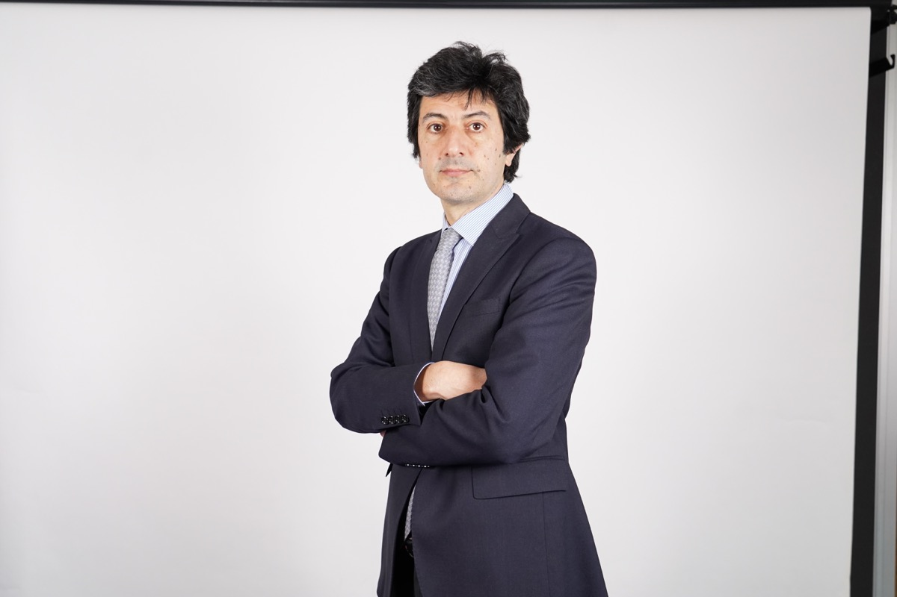
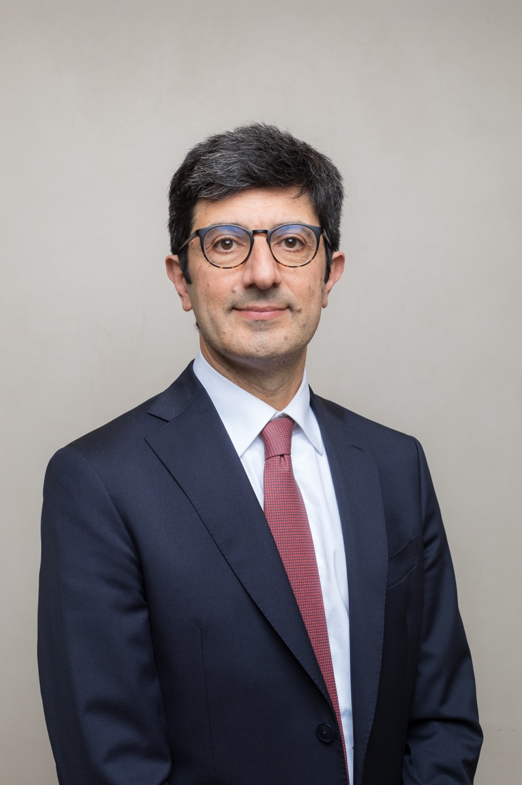

::: {.wrapper}
::: {.main-section}

::: {.about-bio}

# About

Nicola Borri is the Lian Group Chair in Blockchain Technology and Fintech and Associate Professor of Finance in the Department of Corporate Finance and Accounting at Luiss University in Rome. He also serves on the Board of Directors of Banca Ifis. He holds a Ph.D. in Economics from Boston University and a B.A. and M.A. in Economics from Bocconi University in Milan. He received the Bonaldo Stringher Fellowship from the Bank of Italy.

His research lies at the intersection of finance and macroeconomics, with a focus on asset pricing, AI, and fintech. His work has been published in leading academic journals, including the *Review of Asset Pricing Studies*, *Journal of Banking & Finance*, *Annual Review of Financial Economics*, *Review of Economic Dynamics*, and *Journal of Empirical Finance*. His research is frequently featured in the media, including *The New York Times*, *Financial Times*, and NPR's *Planet Money*. He also serves as an Associate Editor of *Economics Letters*.

:::
::: {.about-details}

## CV

[Download CV (PDF)](assets/cv/Nicola_Borri_CV.pdf)

## Contact

Nicola Borri  
Luiss University  
Viale Romania 32  
Rome 00197, Italy

nborri[at]luiss[dot]it

[LinkedIn](https://www.linkedin.com/in/nicola-borri-8887061/)

:::

::: {.about-photos}

## Photos

High-resolution photos for event programs and press. Click a photo to download the original file; please credit the photographer.

  <figure class="press-photo">
    
    <figcaption>Photo: Pezzilli &amp; Company</figcaption>
  </figure>
  <figure class="press-photo">
    
    <figcaption>Photo: Alvise Busetto</figcaption>
  </figure>

:::

:::
::: {.sidenav}

:::
:::
